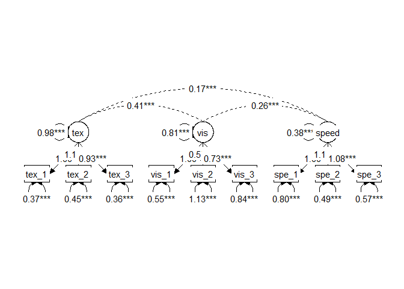

Untitled
================
11 March, 2021

This manuscript uses the Workflow for Open Reproducible Code in Science
(Van Lissa et al. 2020) to ensure reproducibility and transparency. All
code <!--and data--> are available at
<git@github.com:cjvanlissa/worcs_oscoffee.git>.

This is an example of a non-essential citation (Van Lissa et al. 2020).
If you change the rendering function to `worcs::cite_essential`, it will
be removed.

<!--The function below inserts a notification if the manuscript is knit using synthetic data. Make sure to insert it after load_data().-->

## GitHub Documents

This is an R Markdown format used for publishing markdown documents to
GitHub. When you click the **Knit** button all R code chunks are run and
a markdown file (.md) suitable for publishing to GitHub is generated.

## Including Code

You can include R code in the document as follows:

    ## Warning: package 'lavaan' was built under R version 4.0.4

| name   | type    |   n |   missing | unique |      mean |    median |       mode | mode\_value |        sd |         v |        min |       max |     range |        skew |   skew\_2se |        kurt |   kurt\_2se |
| :----- | :------ | --: | --------: | -----: | --------: | --------: | ---------: | :---------- | --------: | --------: | ---------: | --------: | --------: | ----------: | ----------: | ----------: | ----------: |
| sex    | integer | 301 | 0.0000000 |      2 |  1.514950 |  2.000000 |   2.000000 | NA          | 0.5006087 |        NA |  1.0000000 |  2.000000 |  1.000000 | \-0.0595295 | \-0.2118648 | \-2.0030779 | \-3.5760119 |
| ageyr  | integer | 301 | 0.0000000 |      6 | 12.996678 | 13.000000 |  13.000000 | NA          | 1.0503915 |        NA | 11.0000000 | 16.000000 |  5.000000 |   0.6945948 |   2.4720536 |   0.2045723 |   0.3652145 |
| agemo  | integer | 301 | 0.0000000 |     12 |  5.375415 |  5.000000 |   5.000000 | NA          | 3.4518488 |        NA |  0.0000000 | 11.000000 | 11.000000 |   0.0892744 |   0.3177265 | \-1.2186405 | \-2.1755883 |
| school | factor  | 301 | 0.0000000 |      3 |        NA |        NA | 156.000000 | Pasteur     |        NA | 0.4993322 |         NA |        NA |        NA |          NA |          NA |          NA |          NA |
| grade  | integer | 300 | 0.0033223 |      3 |  7.476667 |  7.000000 |   7.000000 | NA          | 0.5002898 |        NA |  7.0000000 |  8.000000 |  1.000000 |   0.0929683 |   0.3303284 | \-1.9979835 | \-3.5610827 |
| vis\_1 | numeric | 301 | 0.0000000 |     35 |  4.935770 |  5.000000 |   5.000000 | NA          | 1.1674321 |        NA |  0.6666667 |  8.500000 |  7.833333 | \-0.2543455 | \-0.9052123 |   0.3075338 |   0.5490274 |
| vis\_2 | numeric | 301 | 0.0000000 |     25 |  6.088040 |  6.000000 |   6.000000 | NA          | 1.1774506 |        NA |  2.2500000 |  9.250000 |  7.000000 |   0.4700766 |   1.6729963 |   0.3323940 |   0.5934092 |
| vis\_3 | numeric | 301 | 0.0000000 |     35 |  2.250415 |  2.125000 |   2.125000 | NA          | 1.1309794 |        NA |  0.2500000 |  4.500000 |  4.250000 |   0.3834294 |   1.3646202 | \-0.9075264 | \-1.6201693 |
| tex\_1 | numeric | 301 | 0.0000000 |     20 |  3.060908 |  3.000000 |   3.000000 | NA          | 1.1641163 |        NA |  0.0000000 |  6.333333 |  6.333333 |   0.2674867 |   0.9519816 |   0.0801268 |   0.1430470 |
| tex\_2 | numeric | 301 | 0.0000000 |     25 |  4.340532 |  4.500000 |   4.500000 | NA          | 1.2904722 |        NA |  1.0000000 |  7.000000 |  6.000000 | \-0.3497961 | \-1.2449196 | \-0.5525369 | \-0.9864212 |
| tex\_3 | numeric | 301 | 0.0000000 |     40 |  2.185572 |  2.000000 |   2.000000 | NA          | 1.0956031 |        NA |  0.1428571 |  6.142857 |  6.000000 |   0.8579486 |   3.0534276 |   0.8165572 |   1.4577656 |
| spe\_1 | numeric | 301 | 0.0000000 |     97 |  4.185902 |  4.086957 |   4.086957 | NA          | 1.0895335 |        NA |  1.3043478 |  7.434783 |  6.130435 |   0.2490881 |   0.8865012 | \-0.3074039 | \-0.5487954 |
| spe\_2 | numeric | 301 | 0.0000000 |     84 |  5.527076 |  5.500000 |   5.500000 | NA          | 1.0126151 |        NA |  3.0500000 | 10.000000 |  6.950000 |   0.5252580 |   1.8693862 |   1.1715556 |   2.0915297 |
| spe\_3 | numeric | 301 | 0.0000000 |    129 |  5.374123 |  5.416667 |   5.416667 | NA          | 1.0091517 |        NA |  2.7777778 |  9.250000 |  6.472222 |   0.2038709 |   0.7255737 |   0.2899079 |   0.5175606 |

## Analysis

| mplus\_label     | est\_sig   | confint        | est\_std | confint\_std   |
| :--------------- | :--------- | :------------- | :------- | :------------- |
| vis.BY.vis\_1    | 1.00       | \[1.00, 1.00\] | 0.77     | \[0.66, 0.88\] |
| vis.BY.vis\_2    | 0.55\*\*\* | \[0.36, 0.75\] | 0.42     | \[0.31, 0.54\] |
| vis.BY.vis\_3    | 0.73\*\*\* | \[0.52, 0.94\] | 0.58     | \[0.47, 0.69\] |
| tex.BY.tex\_1    | 1.00       | \[1.00, 1.00\] | 0.85     | \[0.81, 0.90\] |
| tex.BY.tex\_2    | 1.11\*\*\* | \[0.98, 1.24\] | 0.86     | \[0.81, 0.90\] |
| tex.BY.tex\_3    | 0.93\*\*\* | \[0.82, 1.03\] | 0.84     | \[0.79, 0.88\] |
| speed.BY.spe\_1  | 1.00       | \[1.00, 1.00\] | 0.57     | \[0.47, 0.67\] |
| speed.BY.spe\_2  | 1.18\*\*\* | \[0.86, 1.50\] | 0.72     | \[0.62, 0.82\] |
| speed.BY.spe\_3  | 1.08\*\*\* | \[0.79, 1.38\] | 0.67     | \[0.56, 0.77\] |
| Variances.vis\_1 | 0.55\*\*\* | \[0.33, 0.77\] | 0.40     | \[0.24, 0.57\] |
| Variances.vis\_2 | 1.13\*\*\* | \[0.93, 1.33\] | 0.82     | \[0.72, 0.92\] |
| Variances.vis\_3 | 0.84\*\*\* | \[0.67, 1.02\] | 0.66     | \[0.54, 0.79\] |
| Variances.tex\_1 | 0.37\*\*\* | \[0.28, 0.46\] | 0.27     | \[0.20, 0.35\] |
| Variances.tex\_2 | 0.45\*\*\* | \[0.33, 0.56\] | 0.27     | \[0.19, 0.34\] |
| Variances.tex\_3 | 0.36\*\*\* | \[0.27, 0.44\] | 0.30     | \[0.22, 0.37\] |
| Variances.spe\_1 | 0.80\*\*\* | \[0.64, 0.96\] | 0.68     | \[0.56, 0.79\] |
| Variances.spe\_2 | 0.49\*\*\* | \[0.34, 0.63\] | 0.48     | \[0.33, 0.62\] |
| Variances.spe\_3 | 0.57\*\*\* | \[0.43, 0.70\] | 0.56     | \[0.42, 0.69\] |
| Variances.vis    | 0.81\*\*\* | \[0.52, 1.09\] | 1.00     | \[1.00, 1.00\] |
| Variances.tex    | 0.98\*\*\* | \[0.76, 1.20\] | 1.00     | \[1.00, 1.00\] |
| Variances.speed  | 0.38\*\*\* | \[0.21, 0.55\] | 1.00     | \[1.00, 1.00\] |
| vis.WITH.tex     | 0.41\*\*\* | \[0.26, 0.55\] | 0.46     | \[0.33, 0.58\] |
| vis.WITH.speed   | 0.26\*\*\* | \[0.15, 0.37\] | 0.47     | \[0.33, 0.61\] |
| tex.WITH.speed   | 0.17\*\*\* | \[0.08, 0.27\] | 0.28     | \[0.15, 0.42\] |

## Picture

Van Lissa, Caspar J., Andreas M. Brandmaier, Loek Brinkman, Anna-Lena
Lamprecht, Aaron Peikert, Marijn E. Struiksma, and Barbara Vreede. 2020.
“WORCS: A Workflow for Open Reproducible Code in Science,” May.
<https://doi.org/10.17605/OSF.IO/ZCVBS>.

